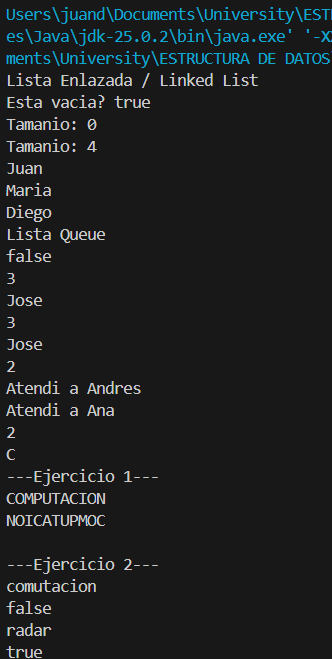
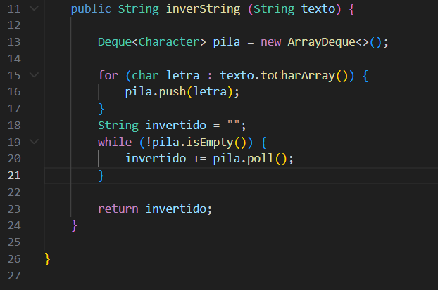

# Practica: Estructuras Dinamicas Lineales

## Datos
- **Nombre:** Juan Cedillo
- **Curso:** Estructura de Datos
- **Fecha:** 10 de junio de 2026

## 1. Implementacion de estructuras dinámicas lineales
**Fecha:** 8 de junio de 2026

**Descripción:**
En esta seccion se implementaran las siguiente estructuras dinamicas lineales:
- Listas enlazadas con LinkedList
- Pilas con Strack y Deque
- Colas con Queue

### Captura de salida en consola


### Captura del código de implementación del ejercicio 1
Ejercicio 1: Invertir un string utilizando una pila


## 2. Ejercicio Palíndromo

**Fecha:** 10 de junio de 2026

**Descripción:**
Ejercicio 2: Verifica si un texto es palindromo es decir que se lee igual de izquierda a derecha que de derecha a izquierda.

### Método implementado

````java
public boolean esPalindromo(String texto) {
        Stack<Character> pila = new Stack<>();
        for (char letra : texto.toCharArray()) {
            pila.push(letra);
        }

        for (char letra : texto.toCharArray()) {
            if (letra != pila.pop()) {
                return false;
            }
        }

        return true;
    }


